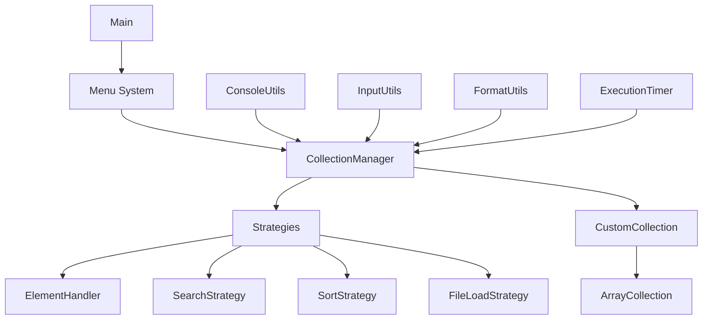

# 🎯 Система управления коллекциями

## 📊 Основные компоненты системы и их назначение

### 🏗️ Архитектурные компоненты

| Компонент | Назначение | Ключевые особенности |
|-----------|------------|---------------------|
| **Main** | Точка входа в приложение | Инициализация системы, создание менеджеров, запуск главного меню |
| **Menu** | Система навигации и управления | Иерархические меню, обработка действий, управление состоянием |
| **CollectionManager** | Управление конкретной коллекцией | Координация операций, использование стратегий, управление данными |
| **CollectionManagerFactory** | Фабрика менеджеров коллекций | Создание менеджеров с нужными стратегиями, централизованная инициализация |
| **CurrentCollectionManager** | Хранилище текущего состояния | Управление выбранной коллекцией, предоставление доступа к текущим данным |

### 📦 Модели данных

| Компонент | Назначение | Структура данных |
|-----------|------------|------------------|
| **Student** | Модель студента | Группа, средний балл, номер зачетки |
| **Bus** | Модель автобуса | Номер, модель, пробег |
| **User** | Модель пользователя | Имя, пароль, email |

## 🎯 Стратегии (Strategy Pattern)

### 🔧 Обработка элементов

| Компонент | Назначение | Методы |
|-----------|------------|--------|
| **ElementHandler** | Интерфейс создания элементов | `createElementManually()`, `getTableHeaders()`, `convertToTableRow()` |
| **StudentHandler** | Создание студентов | Ввод группу, среднего балла, номера зачетки |
| **BusHandler** | Создание автобусов | Ввод номера, модели, пробега |
| **UserHandler** | Создание пользователей | Ввод имени, пароля, email |

### 🔍 Поиск

| Компонент | Назначение | Алгоритмы поиска |
|-----------|------------|------------------|
| **SearchStrategy** | Интерфейс поиска | `search()`, `getSearchDescription()` |
| **StudentSearchStrategy** | Поиск студентов | По группе, номеру зачетки, среднему баллу |
| **BusSearchStrategy** | Поиск автобусов | По номеру, модели, пробегу |
| **UserSearchStrategy** | Поиск пользователей | По имени, email, паролю |

### 🔄 Сортировка

| Компонент | Назначение | Алгоритмы сортировки |
|-----------|------------|---------------------|
| **SortStrategy** | Интерфейс сортировки | `sort()`, `getSortDescription()` |
| **StudentSortStrategy** | Сортировка студентов | По группе и среднему баллу |
| **BusSortStrategy** | Сортировка автобусов | По модели и пробегу |
| **UserSortStrategy** | Сортировка пользователей | По имени |

### 💾 Загрузка из файла

| Компонент | Назначение | Форматы файлов |
|-----------|------------|----------------|
| **FileLoadStrategy** | Интерфейс загрузки | `loadFromFile()`, `getFileFormatDescription()` |
| **StudentFileLoadStrategy** | Загрузка студентов | CSV: Группа,Средний балл,Номер зачетки |
| **BusFileLoadStrategy** | Загрузка автобусов | CSV: Номер;Модель;Пробег |
| **UserFileLoadStrategy** | Загрузка пользователей | CSV: Имя\|Пароль\|Email |

### 💾 Коллекции

| Компонент | Назначение | Особенности реализации |
|-----------|------------|------------------------|
| **CustomCollection** | Интерфейс коллекции | CRUD операции, управление емкостью |
| **ArrayCollection** | Реализация коллекции | Динамический массив, автоматическое расширение |

## 🎨 Утилиты

### ⌨️ Ввод/вывод

| Компонент | Назначение | Основные функции |
|-----------|------------|------------------|
| **ConsoleUtils** | Базовые утилиты консоли | `printInfo()`, `printError()`, `pause()`, `exit()` |
| **InputUtils** | Ввод данных с валидацией | `readInt()`, `readDouble()`, `readString()`, `readBooleanInverted()` |
| **ConsoleColor** | Управление цветами | ANSI цвета, форматирование текста |
| **FormatUtils** | Форматирование вывода | `printTable()`, `showProgressBar()` |

### ⏱️ Производительность

| Компонент | Назначение | Методы |
|-----------|------------|--------|
| **ExecutionTimer** | Замер времени выполнения | `measureExecutionTime()`, `formatTime()`, `TimedResult` |

## 🔄 Взаимодействие компонентов



## 📁 Структура проекта

```
src/
├── main/
│   ├── java/
│   │   └── org/
│   │       └── aston/
│   │           └── learning/
│   │               └── stage1/
│   │                   ├── Main.java                 # Точка входа
│   │                   ├── collection/              # Реализации коллекций
│   │                   │   ├── ArrayCollection.java
│   │                   │   └── CustomCollection.java
│   │                   ├── menu/                    # Система меню и управления
│   │                   │   ├── CollectionAction.java
│   │                   │   ├── CollectionManager.java
│   │                   │   ├── CollectionManagerFactory.java
│   │                   │   ├── CurrentCollectionManager.java
│   │                   │   ├── Menu.java
│   │                   │   └── MenuAction.java
│   │                   ├── menu/strategy/           # Стратегии работы с данными
│   │                   │   ├── ElementHandler.java
│   │                   │   ├── FileLoadStrategy.java
│   │                   │   ├── SearchStrategy.java
│   │                   │   └── SortStrategy.java
│   │                   ├── menu/strategy/impl/      # Реализации стратегий
│   │                   │   ├── *Handler.java
│   │                   │   ├── *SearchStrategy.java
│   │                   │   ├── *SortStrategy.java
│   │                   │   └── *FileLoadStrategy.java
│   │                   ├── model/                   # Модели данных
│   │                   │   ├── Student.java
│   │                   │   ├── Bus.java
│   │                   │   └── User.java
│   │                   └── util/                    # Вспомогательные утилиты
│   │                       ├── ExecutionTimer.java
│   │                       └── console/
│   │                           ├── ConsoleColor.java
│   │                           ├── ConsoleUtils.java
│   │                           ├── FormatUtils.java
│   │                           └── InputUtils.java
```

## 🎯 Текущие возможности

### 📊 Выбор коллекции
- **Студенты**;
- **Автобусы**;
- **Пользователи**.

### 🔄 Операции с данными
- **Ручное заполнение** - интерактивное создание элементов;
- **Загрузка из файла** - "заглушка";
- **Случайное заполнение** - "заглушка";
- **Очистка коллекции** - удаление всех элементов.

### ⚙️ Функции обработки
- **Установка длины** - изменение вместимости коллекции;
- **Сортировка** - "заглушка";
- **Поиск** - "заглушка";
- **Просмотр** - отображение коллекции в табличном формате.

## 🏗️ Архитектура

### 📋 Модели данных
- **Student**: группа, средний балл, номер зачетки;
- **Bus**: номер, модель, пробег;
- **User**: имя, пароль, email.

### 🎮 Система меню
Иерархическая система с поддержкой:
- Главного меню;
- Подменю выбора коллекции;
- Подменю операций заполнения;
- Подменю операций обработки.

### 🎯 Стратегический паттерн
Для каждой операции используются отдельные стратегии:
- **ElementHandler** - работа с консольным интерфейсом;
- **SearchStrategy** - алгоритмы поиска;
- **SortStrategy** - алгоритмы сортировки;
- **FileLoadStrategy** - загрузка из файлов.

### 💾 Кастомная коллекция
`ArrayCollection` реализует интерфейс `CustomCollection` с:
- Динамическим расширением;
- Типизированным хранением;
- Базовыми операциями CRUD.

### 🎨 Интерфейс

- **Цветовое оформление** (enum ConsoleColor + ConsoleUtils) - использование ANSI-цветов для улучшения читаемости;
- **Табличное отображение** (FormatUtils) - форматированный вывод данных;
- **Прогресс-бары** (FormatUtils) - визуализация длительных операций;
- **Валидация ввода** (InputUtils) - проверка и обработка пользовательского ввода.

### ⏱️ Производительность

- **Тайминг операций** (ExecutionTimer) - замер времени выполнения всех операций.

---

## 📋 Система меню

### 🏗️ Структура меню
Система использует иерархическую структуру меню:

```java
// Главное меню
new Menu("Главное меню")
    .addAction("Выбор коллекции", collectionSelectMenu::open)
    .addAction("Заполнение коллекции", fillMenu::open)
    .addAction("Действия над коллекцией", operationsMenu::open)
    .open();
```

### 📝 Создание меню

**Базовое меню** (выход из программы):
```java
Menu mainMenu = new Menu("Главное меню");
```

**Подменю** (возврат в родительское меню):
```java
Menu subMenu = new Menu("Заполнение коллекции", "Главное меню");
```

### 🔗 Привязка действий

**Простое действие**:
```java
menu.addAction("Просмотреть", () -> {
        System.out.println("Действие выполнено!");
});
```

**Действие с параметрами**:
```java
menu.addAction("Выбрать студента", () -> selectCollection(studentManager));
```

**Вызов другого меню**:
```java
menu.addAction("Операции", operationsMenu::open);
```

### 🎮 Управление меню

**Открытие меню**:
```java
menu.open(); // Запускает цикл отображения и обработки
```

**Закрытие меню**:
```java
menu.close(); // Возврат к родительскому меню
```

---

## 📋 ConsoleUtils - Утилиты для работы с консолью

### 🎯 Основные функции

**Управление выводом**:
```java
// Информационное сообщение
ConsoleUtils.printInfo("Операция завершена успешно");

// Сообщение об ошибке
ConsoleUtils.printError("Произошла ошибка!");

// Сообщение об успехе
ConsoleUtils.printSuccess("Данные сохранены");

// Предупреждение
ConsoleUtils.printWarning("Коллекция почти заполнена");
```

**Управление выполнением**:
```java
// Пауза с ожиданием Enter
ConsoleUtils.pause();

// Завершение программы
ConsoleUtils.exit();
```

### 💡 Пример использования
```java
public void showCollection() {
    if (collection.isEmpty()) {
        ConsoleUtils.printInfo("Коллекция пуста");
        ConsoleUtils.pause();
        return;
    }

    // ... вывод данных ...
    ConsoleUtils.printSuccess("Данные отображены успешно");
    ConsoleUtils.pause();
}
```

---

## ⌨️ InputUtils - Утилиты для ввода данных

### 📝 Методы ввода

**Ввод целого числа с валидацией**:
```java
// Ввод числа в диапазоне [min, max]
int age = InputUtils.readInt("Введите возраст: ", 0, 120);

// Ввод без ограничений (кроме int диапазона)
int number = InputUtils.readInt("Введите число: ", Integer.MIN_VALUE, Integer.MAX_VALUE);
```

**Ввод дробного числа**:
```java
// Ввод double с валидацией
double price = InputUtils.readDouble("Введите цену: ", 0.0, 1000000.0);

// Ввод среднего балла
double average = InputUtils.readDouble("Средний балл: ", 0.0, 5.0);
```

**Ввод строки**:
```java
// Обязательное поле
String name = InputUtils.readString("Введите имя: ", true);

// Необязательное поле
String description = InputUtils.readString("Описание (необязательно): ", false);
```

**Ввод boolean (да/нет)**:
```java
// Возвращает true для "n/no", false для "y/yes"
boolean shouldCancel = InputUtils.readBooleanInverted("Отменить операцию?");
if (shouldCancel) {
        ConsoleUtils.printInfo("Операция отменена");
    return;
            }
```

### 🔄 Пример комплексного ввода
```java
public Student createStudentManually() {
    ConsoleUtils.printInfo("=== Создание нового студента ===");

    String group = InputUtils.readString("Группа: ", true);
    double average = InputUtils.readDouble("Средний балл: ", 0.0, 5.0);
    String recordBook = InputUtils.readString("Номер зачетки: ", true);

    // Подтверждение
    boolean cancel = InputUtils.readBooleanInverted("Все верно?");
    if (cancel) {
        ConsoleUtils.printWarning("Создание отменено");
        return null;
    }

    return new Student(group, average, recordBook);
}
```

---

## 🎨 FormatUtils - Форматирование вывода

### 📊 Табличное отображение

**Создание таблицы**:
```java
// Заголовки таблицы
String[] headers = {"ID", "Имя", "Возраст", "Группа"};

// Данные для таблицы
String[][] data = {
        {"1", "Иван Иванов", "20", "ИТ-101"},
        {"2", "Мария Петрова", "21", "ИТ-102"},
        {"3", "Алексей Сидоров", "19", "ИТ-101"}
};

// Вывод таблицы
FormatUtils.printTable(headers, data);
```

### 📊 Прогресс-бар

**Отображение прогресса**:
```java
public void processItems(List<Item> items) {
    System.out.println("Обработка элементов:");

    for (int i = 0; i < items.size(); i++) {
        // Обработка элемента
        processItem(items.get(i));

        // Обновление прогресс-бара
        FormatUtils.showProgressBar(i + 1, items.size(), 50);

        // Небольшая задержка для визуализации
        try {
            Thread.sleep(100);
        } catch (InterruptedException e) {
            Thread.currentThread().interrupt();
        }
    }

    System.out.println("\nОбработка завершена!");
}
```

---

## 🚀 Комплексный пример

### 📋 Регистрация пользователя
```java
public User registerUser() {
    ConsoleUtils.printInfo("=== РЕГИСТРАЦИЯ ПОЛЬЗОВАТЕЛЯ ===");

    // Ввод данных
    String name = InputUtils.readString("Введите имя: ", true);
    String email = InputUtils.readString("Введите email: ", true);
    String password = InputUtils.readString("Введите пароль: ", true);

    // Подтверждение
    ConsoleUtils.printInfo("\nПроверьте введенные данные:");
    String[][] userData = {
            {"Имя:", name},
            {"Email:", email},
            {"Пароль:", "*".repeat(password.length())}
    };

    FormatUtils.printTable(new String[]{"Поле", "Значение"}, userData);

    boolean cancel = InputUtils.readBooleanInverted("Все верно?");
    if (cancel) {
        ConsoleUtils.printWarning("Регистрация отменена");
        return null;
    }

    // Создание пользователя
    User user = new User(name, password, email);
    ConsoleUtils.printSuccess("Пользователь успешно создан!");

    return user;
}
```

### 📊 Отчет о выполнении операции
```java
public void generateReport(String operationName, long executionTime, int itemsProcessed) {
    ConsoleColor.printlnColor("\n=== ОТЧЕТ О ВЫПОЛНЕНИИ ===", ConsoleColor.BLUE_BOLD);

    String[][] reportData = {
            {"Операция:", operationName},
            {"Время выполнения:", ExecutionTimer.formatTime(executionTime)},
            {"Обработано элементов:", String.valueOf(itemsProcessed)},
            {"Статус:", "УСПЕШНО"}
    };

    FormatUtils.printTable(new String[]{"Параметр", "Значение"}, reportData);

    ConsoleUtils.pause();
}
```

---

## ⏱️ ExecutionTimer - Утилита для замера времени выполнения

### ⏰ Замер операций без возвращаемого значения

**Базовое использование**:
```java
// Простой замер времени
long timeTaken = ExecutionTimer.measureExecutionTime(() -> {
            // Ваш код здесь
            performSomeOperation();
        });

System.out.println("Время выполнения: " + ExecutionTimer.formatTime(timeTaken));
```

**Пример с сортировкой**:
```java
public void measureSorting() {
    long sortingTime = ExecutionTimer.measureExecutionTime(() -> {
        collection.sort(); // Ваш алгоритм сортировки
    });

    ConsoleUtils.printInfo("Сортировка заняла: " + ExecutionTimer.formatTime(sortingTime));
}
```

### 📦 Замер операций с возвращаемым значением

**Использование TimedResult**:
```java
// Замер операции с возвращаемым значением
ExecutionTimer.TimedResult<List<String>> result = ExecutionTimer.measureExecutionTime(() -> {
            return processDataAndReturnResult(); // Ваш метод
        });

// Использование результата и времени
List<String> data = result.result();
long timeMs = result.timeMs();

ConsoleUtils.printSuccess("Получено " + data.size() + " элементов за " +
        ExecutionTimer.formatTime(timeMs));
```

**Пример поиска**:
```java
public void measureSearch() {
    String query = InputUtils.readString("Введите поисковый запрос: ", true);

    ExecutionTimer.TimedResult<CustomCollection<Student>> searchResult =
            ExecutionTimer.measureExecutionTime(() -> {
                return searchStrategy.search(collection, query);
            });

    CustomCollection<Student> results = searchResult.result();
    long searchTime = searchResult.timeMs();

    showSearchResults(results, searchTime);
}
```

---

## 🧾 Выводы
- **Код реализует интерактивное консольное приложение с меню.**
- **Используется полиморфизм для работы с разными типами коллекций.**
- **Лямбды и функциональные интерфейсы упрощают обработку действий.**
- **Текущая коллекция хранится в CurrentCollectionManager.**
- **Меню построено по принципу компоновщика (каждый пункт может быть подменю).**

## 🧾 TODO
1.  **Builder для моделей;**
2.  **Сортировка;**
3.  **Бинарный поиск;**
4.  **Загрузка из файла + валидация данных;**
5.  **Данные для загрузки в коллекцию (около 100 записей), для соответствующих моделей (StudentData.csv, BusData.csv, UserData.csv);**
6.  **Заполнение рандомными данными (тоже загрузка из файла, просто перетасовать их);**
7.  **Расписать несколько тестов для модулей;**
8.  **Сделать валидацию для ввода специфических полей по типу email + отмена ввода;**
9.  **Сортировка по числовому полю (доп. 1);**
10. **Запись данных из коллекций (доп. 2);**
11. **Не забыть переписать заполнение коллекций через стримы (доп. 3);**
12. **Плюс, нужно реализовать многопоточность, где-нибудь и как-нибудь.**